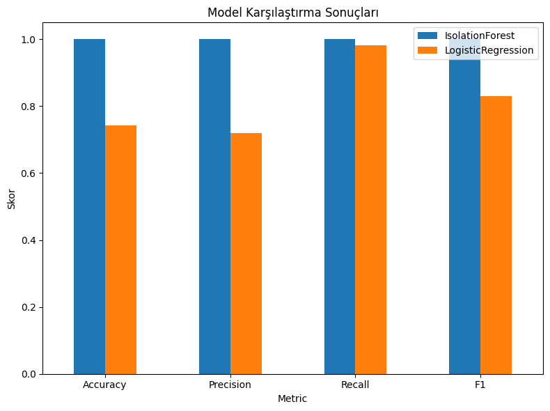

# ML Anomali Modeli

Bu projede, elektrikli şarj istasyonlarından elde edilen telemetri verileri üzerinde **anormal davranışların tespit edilmesi** için makine öğrenmesi tabanlı bir yaklaşım geliştirildi. Temel amaç, istasyonlarda olağandışı tüketim veya saldırı girişimlerini otomatik olarak tanıyabilen bir model oluşturmaktı. Bu kapsamda iki yöntem denendi: **IsolationForest** ve **Logistic Regression**.

---

## Örnek API İsteği

Aşağıda `/ml` servisine gönderilen tipik bir istek örneği yer almaktadır:

```json
POST /ml
{
  "energy": 12.5,
  "duration": 3600,
  "hour": 14,
  "temperature": 25,
  "vehicle_age": 3
}
```

## Örnek API Yanıtı

Model bu isteği işledikten sonra şu şekilde bir yanıt döndürür:

```json
{
  "prediction": "normal",
  "riskLevel": "düşük",
  "riskScore": 0.096
}
```

- **prediction**: Verinin normal mi yoksa anormal mi olduğunu belirtir.  
- **riskLevel**: Risk skorunun “düşük, orta veya yüksek” seviyelerinden hangisine karşılık geldiğini gösterir.  
- **riskScore**: Modelin hesapladığı sayısal değerdir. Skor sıfıra yakınsa düşük risk, negatif değerler normal kabul edilir.  

---

## Model Karşılaştırma Sonuçları

Aşağıdaki görselde, iki modelin performans ölçütleri (Accuracy, Precision, Recall ve F1) karşılaştırmalı olarak verilmiştir:



**IsolationForest:**  
Bu model testlerde olağanüstü yüksek başarı göstermiş ve bütün metriklerde **1.0** değerine ulaşmıştır. Bu durum, modelin mevcut veri setinde anormal davranışları eksiksiz ayırt edebildiğini gösterir. Ancak böylesine kusursuz sonuçların gerçek hayatta her zaman sürdürülebilir olmayabileceğini, yani modelin “aşırı uyum” (overfitting) riskini barındırdığını unutmamak gerekir.

**Logistic Regression:**  
Daha gerçekçi bir tablo çizmiştir:  
- Accuracy: %74  
- Precision: %72  
- Recall: %98  
- F1: %83  

Bu değerler Logistic Regression’un özellikle **Recall** açısından güçlü olduğunu, yani anormal olayları kaçırma ihtimalinin düşük olduğunu gösterir. Fakat Precision’ın daha düşük olması, modelin zaman zaman yanlış alarm üretebileceği anlamına gelir.  

---

## Genel Değerlendirme

Sonuçlar değerlendirildiğinde, **IsolationForest** hızlı prototipleme için oldukça güçlü bir seçenek sunar. Ancak uzun vadede, gerçek saha verileriyle test edilip aşırı uyum riski azaltılmalıdır. **Logistic Regression** ise daha dengeli ve genelleştirilebilir sonuçlar ortaya koymaktadır.  

Bu nedenle önerilen yaklaşım, ilk aşamada IsolationForest ile anormallikleri hızlıca tespit etmek; sonraki aşamalarda ise Logistic Regression veya benzeri denetimli algoritmalarla sistemi desteklemektir. Böylece hem yüksek doğruluk hem de güvenilirlik sağlanabilir.
